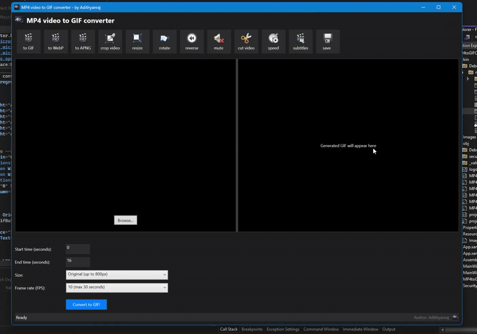

🎬 GUI Video to GIF Converter /Editor


A professional and user-friendly desktop application for converting video files (MP4, AVI, MOV, MKV) to animated GIFs with advanced editing capabilities. This sleek, modern tool provides real-time previews and customizable conversion options.



## ✨ Features

<p align="center">
  
</p>

- 🖥️ **Modern UI** - Dark-themed, professional interface with split-screen preview
- 🎞️ **Live Video Preview** - Watch your video with playback controls before converting
- 🎭 **GIF Preview** - See the output animation immediately after conversion
- 🔄 **Multiple Format Support** - Convert to GIF, WebP, or APNG formats
- ✂️ **Advanced Editing Tools**:
  - Crop video
  - Resize dimensions
  - Rotate orientation
  - Reverse playback
  - Mute audio
  - Cut video segments
  - Adjust playback speed
  - Add subtitles
- ⏱️ **Time Selection** - Choose specific start and end times
- 📏 **Size Options** - Multiple preset dimensions including social media optimized sizes
- 🔢 **Frame Rate Control** - Choose from various FPS settings for optimal quality and file size
- ⚡ **GPU Acceleration** - Utilizes hardware acceleration for faster processing
- 📊 **Progress Tracking** - Real-time progress bar and status updates
- 🖱️ **Drag & Drop** - Easy file selection via drag and drop interface

## 🚀 Getting Started

### Prerequisites

- Windows 8/10/11
- [.NET 8.0 Runtime](https://dotnet.microsoft.com/download/dotnet/8.0) or newer
- FFmpeg (included with application)

### Installation

#### Option 1: Download the Installer

1. Download the latest release from the [Releases page](https://github.com/adithyanraj03/GUI-Video-to-Gif-Editer-Converter/releases)
2. Run the installer and follow the instructions

#### Option 2: Build from Source

```bash
# Clone the repository
git clone https://github.com/adithyanraj03/GUI-Video-to-Gif-Editer-Converter.git

# Navigate to the project directory
cd GUI-Video-to-Gif-Editer-Converter

# Build the project
dotnet build

# Run the application
dotnet run --project .\MP4toGIFConverter\MP4toGIFConverter.csproj
```

## 📖 How to Use

1. **Select Video** - Click "Browse" or drag and drop a video file
2. **Set Parameters**:
   - Adjust start and end times
   - Select output size
   - Choose frame rate
3. **Preview** - Watch the video in the preview pane
4. **Convert** - Click "Convert to GIF!" button
5. **Review** - Check the output in the GIF preview pane
6. **Save** - Save your animated GIF

<p align="center">
  
</p>

## 🛠️ Technologies Used

- **C# / WPF** - Frontend user interface
- **FFmpeg** - Core video processing engine
- **Hardware Acceleration** - GPU-enhanced conversion


## 🔍 Advanced Options

### Frame Rate Selection

| FPS Setting | Max Duration | Best For                |
|-------------|--------------|-------------------------|
| 5 FPS       | 60 seconds   | Slower, larger scenes   |
| 10 FPS      | 30 seconds   | General purpose         |
| 20 FPS      | 15 seconds   | Smoother animations     |
| 33 FPS      | 10 seconds   | High-quality, short clips |

### Size Presets

- **Original (up to 800px)** - Maintains aspect ratio with max dimension of 800px
- **540xAUTO (for Tumblr)** - Optimized for Tumblr posts
- **up to 1200x300** - Wide banner format
- **up to 300x1200** - Skyscraper banner format

## 🔄 Planned Features

- 🎨 Custom watermarking options
- 🔊 Audio extraction to MP3
- 🎞️ Frame-by-frame editing
- 🌈 Color filters and effects
- 🔗 Direct social media sharing

## 🤝 Contributing

Contributions are welcome! Please feel free to submit a Pull Request.

1. Fork the repository
2. Create your feature branch (`git checkout -b feature/amazing-feature`)
3. Commit your changes (`git commit -m 'Add some amazing feature'`)
4. Push to the branch (`git push origin feature/amazing-feature`)
5. Open a Pull Request

## 📜 License

This project is licensed under the MIT License - see the [LICENSE](LICENSE) file for details.

## 📞 Contact

Adithyan Raj - [GitHub](https://github.com/adithyanraj03) - [LinkedIn](https://www.linkedin.com/in/adithya-n-raj-609589230/) 

Email: Click [@adithyanraj03](https://mail.google.com/mail/?view=cm&fs=1&to=adithyanraj03@gmail.com&su=GUI_Video_to_GIF_Converter&body=Hello%20Developer%20Adithya,%0A%0AI%20came%20across%20your%20Git%20repository%20for%20the%20GUI%20Video%20to%20GIF%20Converter%20and%20wanted%20to%20reach%20out.%0A%0AI%27m%20interested%20in%20discussing%20some%20ideas.%0A%0ABest,%0A%5BYour%20Name%5D)

Project Link: [https://github.com/adithyanraj03/GUI-Video-to-Gif-Editer-Converter](https://github.com/adithyanraj03/GUI-Video-to-Gif-Editer-Converter)

## 🙏 Acknowledgements

- [FFmpeg](https://ffmpeg.org/) for the powerful video processing engine
- [.NET Community](https://dotnet.microsoft.com/) for the framework
- [Icons8](https://icons8.com/) for the application icons

---
